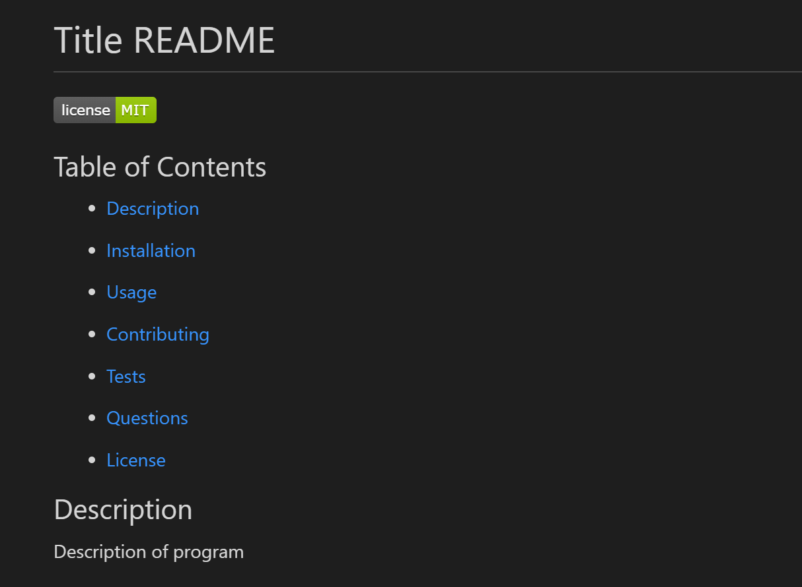

# README Generator

## Description
This application will run the user through a series of prompts in the terminal and will use the responses to create a README file for the user. 

This project was my first time using node. I enjoyed learning how to use the terminal as the source of information input and output rather than the browswer, which I was more experienced with. 

## Installation Requirements

In order to create this program, I had to create dependencies for 'fs' and for the 'inquirer' modules. This required doing an "npm install" for 'inquirer'.
Also, in order to save space, I created a .gitignore so these downloaded items didn't clog up my commits. 

## Sample
Here's a video running through the code in the terminal:

### Contact
Here's a link to my GitHub page for other work! https://github.com/marenhamby